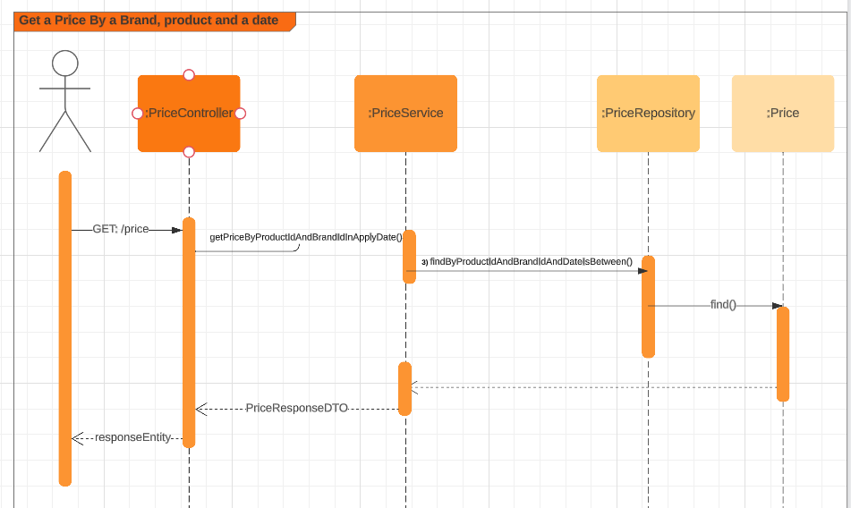
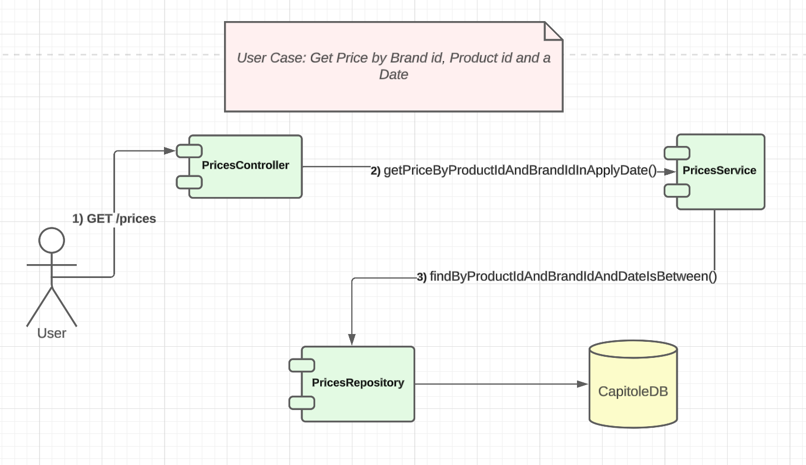

# Capitole-challenge

## Description of the Challenge

#This Proyect Gets a Price from a set of data from a brand, product and a date in which this price is apply, 
if there are two prices in the same range of dates, will be a priority field to define which price list is the 
correct one. 

### Requirements:
- Java 17 
- Maven 
- Git
- Postman

### Instalation
- git clone https://github.com/raulespinola/capitole-challenge
- mvn clean
- mvn install

### Api
- Swagger: http://localhost:8080/swagger-ui/#
- Endpoint: Get Price By ProductId, BrandId and a Date:
  - Example
    - Request: "http://localhost:8080/?productId=35455&brandId=1&date=2020-06-15T16:00:00.000"
    - Response: 
      - {
        "productId": 35455,
        "brandId": 1,
        "priceList": 4,
        "startDate": "2020-06-15T16:00:00",
        "endDate": "2020-12-31T23:59:59",
        "price": 38.95
        }

### Secuencial Diagram for the UserCase
   

### Component Diagram for the UserCase
